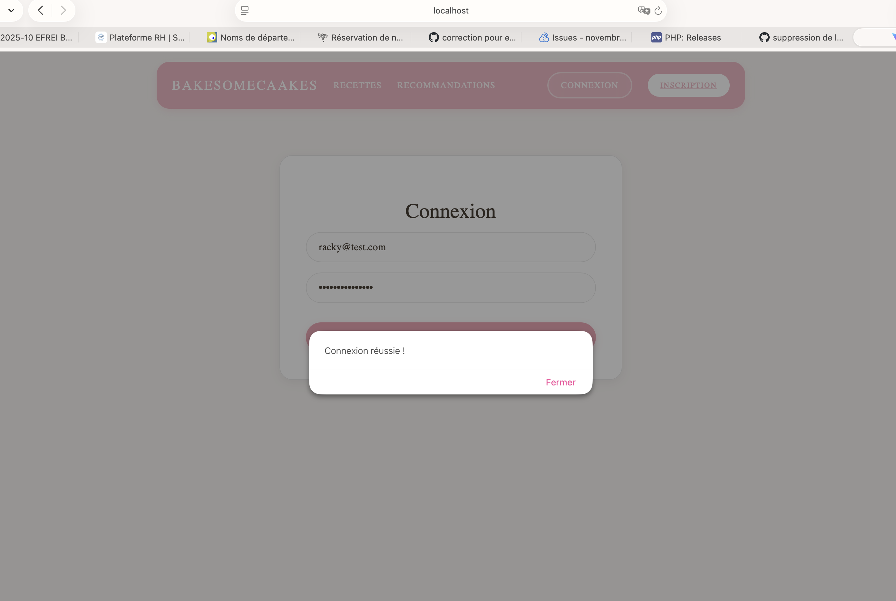
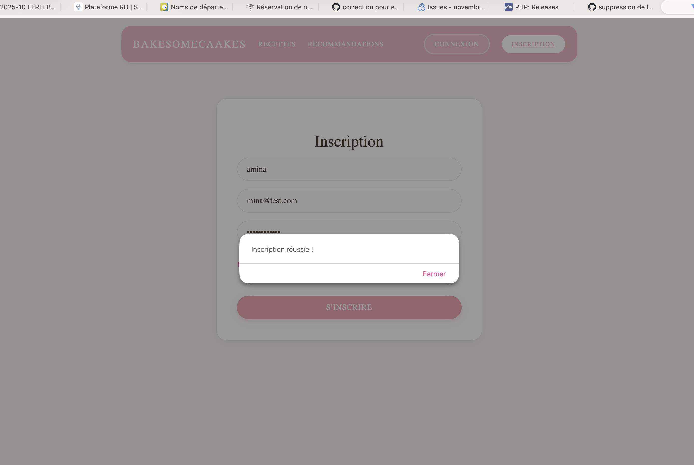
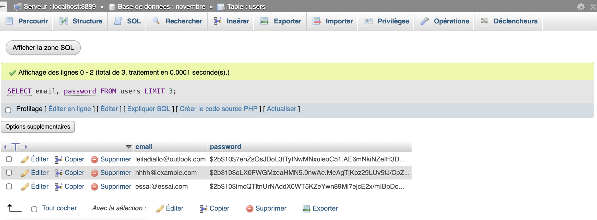

# bakesomecaakes

**bakesomecaakes** est une application web de blog de pâtisserie permettant aux utilisateurs de découvrir, rechercher et liker des recettes de pâtisserie. L'application dispose d'un système d'authentification sécurisé, d'un rôle administrateur pour la gestion du contenu, et d'une interface moderne inspirée de Pinterest et Marmiton.

## Table des matières

- [À propos du projet](#-à-propos-du-projet)
- [Architecture](#-architecture)
- [Technologies utilisées](#-technologies-utilisées)
- [Prérequis](#-prérequis)
- [Installation](#-installation)
- [Configuration](#-configuration)
- [Initialisation de la base de données](#-initialisation-de-la-base-de-données)
- [Création d'un compte administrateur](#-création-dun-compte-administrateur)
- [Démarrage du projet](#-démarrage-du-projet)
- [Structure du projet](#-structure-du-projet)
- [Scripts disponibles](#-scripts-disponibles)
- [Tests](#-tests)
- [Sécurité](#-sécurité)
- [Fonctionnalités](#-fonctionnalités)

---

## À propos du projet

**bakesomecaakes** est un projet pédagogique développé dans le cadre d'un module de sécurité des applications web. L'objectif principal est de créer une application web complète en respectant les meilleures pratiques de sécurité :

- Authentification robuste avec JWT et cookies sécurisés
- Protection contre les injections SQL (requêtes préparées)
- Protection contre les attaques XSS
- Conformité RGPD (consentement explicite, mentions légales)
- Headers de sécurité HTTP
- Gestion sécurisée des secrets

### But du projet

Le projet permet aux utilisateurs de :
- Consulter des recettes de pâtisserie
- Rechercher des recettes par mot-clé
- Liker leurs recettes préférées
- Créer un compte et gérer son profil
- S'authentifier de manière sécurisée

L'administrateur (moi) peut :
- Créer, modifier et supprimer des recettes
- Gérer les utilisateurs
- Modifier la description du site
- Personnaliser le contenu

---

## Architecture

Le projet suit une architecture **client-serveur** avec séparation frontend/backend :

```
bakesomecaakes/
├── frontend/          # Application React (client)
│   ├── src/
│   │   ├── pages/     # Pages de l'application
│   │   ├── components/# Composants réutilisables
│   │   └── services/  # Services API
│   └── package.json
│
└── backend/           # API Express (serveur)
    ├── controllers/   # Logique métier
    ├── routes/        # Définition des routes
    ├── middlewares/   # Middlewares (auth, validation)
    ├── config/        # Configuration (BDD)
    └── tests/         # Tests unitaires et d'intégration
```

### Communication Frontend ↔ Backend

- **Frontend** : React avec React Router pour la navigation
- **Backend** : API REST Express.js
- **Communication** : Axios pour les requêtes HTTP
- **Authentification** : JWT stocké dans des cookies HttpOnly

---

## Technologies utilisées

### Frontend
- **React 19** : Bibliothèque UI
- **React Router DOM 7** : Routage
- **Axios** : Client HTTP
- **Vite** : Build tool et serveur de développement
- **ESLint + Prettier** : Qualité et formatage du code

### Backend
- **Node.js** : Runtime JavaScript
- **Express 5** : Framework web
- **MySQL2** : Driver MySQL avec support des promesses
- **JWT (jsonwebtoken)** : Authentification par tokens
- **bcryptjs** : Hachage des mots de passe
- **express-validator** : Validation des données
- **Helmet** : Headers de sécurité HTTP
- **CORS** : Gestion des requêtes cross-origin
- **Jest + Supertest** : Tests unitaires et d'intégration

### Base de données
- **MySQL** : Base de données relationnelle

---

## Prérequis

Avant de commencer, assurez-vous d'avoir installé :

- **Node.js** (version 22.x recommandée)
  - [Télécharger Node.js](https://nodejs.org/) (npm est inclus automatiquement)
  - Alternative avec gestionnaire de versions : [nvm (Node Version Manager)](https://github.com/nvm-sh/nvm)
- **npm** (généralement inclus avec Node.js)
  - Si npm n'est pas installé : `npm` est automatiquement inclus avec Node.js
  - [Documentation npm](https://docs.npmjs.com/)
- **MySQL** (version 8.0 ou supérieure)
  - [Télécharger MySQL](https://dev.mysql.com/downloads/mysql/)
  - Alternative : [XAMPP](https://www.apachefriends.org/) (inclut MySQL) ou [MAMP](https://www.mamp.info/) (macOS/Windows)
  - Pour macOS avec Homebrew : `brew install mysql`
  - Pour Linux (Ubuntu/Debian) : `sudo apt-get install mysql-server`
- **Git** (pour cloner le dépôt)
  - [Télécharger Git](https://git-scm.com/downloads)

### Vérification des prérequis

Vérifiez que tous les outils sont installés :

```bash
node --version    # Doit afficher v22.x.x ou supérieur
npm --version     # Doit afficher 10.x.x ou supérieur
mysql --version   # Doit afficher 8.0.x ou supérieur
git --version     # Doit afficher la version de Git
```

Si une commande retourne `command not found`, installez l'outil correspondant en utilisant les liens ci-dessus.

---

## Installation

### 1. Cloner le dépôt

```bash
git clone <url-du-depot>
cd novembre
```

### 2. Installer les dépendances du backend

```bash
cd backend
npm install
```

### 3. Installer les dépendances du frontend

```bash
cd ../frontend
npm install
```

---

## Configuration

### Configuration du backend

1. **Créer le fichier `.env`** dans le dossier `backend/` :

```bash
cd backend
cp .env.example .env
```

2. **Modifier le fichier `.env`** avec vos paramètres :

```env
# Configuration de la base de données MySQL
DB_HOST=localhost
DB_PORT=3306
DB_USER=root
DB_PASSWORD=votre_mot_de_passe_mysql
DB_NAME=bakesomecaakes

# Secret pour la génération des tokens JWT
# IMPORTANT : Utilisez une chaîne aléatoire longue et complexe en production
JWT_SECRET=votre_secret_jwt_tres_long_et_aleatoire

# Port du serveur Express (optionnel, par défaut 5001)
PORT=5001

# Environnement d'exécution
NODE_ENV=development

# URL de base pour redirection HTTPS en production
APP_BASE_URL=
```

**Important** : Pour générer un `JWT_SECRET` sécurisé, utilisez :

```bash
node -e "console.log(require('crypto').randomBytes(64).toString('hex'))"
```

### Configuration du frontend

Le frontend n'utilise pas de fichier `.env` pour l'instant. L'URL de l'API est configurée dans `frontend/src/services/api.js` et pointe par défaut vers `http://localhost:5001`.

---

## Initialisation de la base de données

### 1. Créer la base de données

Connectez-vous à MySQL et créez la base de données :

```sql
CREATE DATABASE novembre CHARACTER SET utf8mb4 COLLATE utf8mb4_unicode_ci;
```

### 2. Créer les tables

Exécutez les requêtes SQL suivantes dans votre client MySQL (phpMyAdmin, MySQL Workbench, ou ligne de commande) :

#### Table `users`

```sql
CREATE TABLE users (
  id INT AUTO_INCREMENT PRIMARY KEY,
  username VARCHAR(100) NOT NULL,
  email VARCHAR(255) NOT NULL UNIQUE,
  password VARCHAR(255) NOT NULL,
  role ENUM('user', 'admin') DEFAULT 'user',
  created_at TIMESTAMP DEFAULT CURRENT_TIMESTAMP
) ENGINE=InnoDB DEFAULT CHARSET=utf8mb4 COLLATE=utf8mb4_unicode_ci;
```

#### Table `recipes`

```sql
CREATE TABLE recipes (
  id INT AUTO_INCREMENT PRIMARY KEY,
  title VARCHAR(255) NOT NULL,
  description TEXT,
  image VARCHAR(500),
  ingredients TEXT,
  steps TEXT,
  user_id INT,
  created_at TIMESTAMP DEFAULT CURRENT_TIMESTAMP,
  updated_at TIMESTAMP DEFAULT CURRENT_TIMESTAMP ON UPDATE CURRENT_TIMESTAMP,
  FOREIGN KEY (user_id) REFERENCES users(id) ON DELETE SET NULL
) ENGINE=InnoDB DEFAULT CHARSET=utf8mb4 COLLATE=utf8mb4_unicode_ci;
```

#### Table `recipe_likes`

```sql
CREATE TABLE recipe_likes (
  id INT AUTO_INCREMENT PRIMARY KEY,
  user_id INT NOT NULL,
  recipe_id INT NOT NULL,
  created_at TIMESTAMP DEFAULT CURRENT_TIMESTAMP,
  UNIQUE KEY unique_like (user_id, recipe_id),
  FOREIGN KEY (user_id) REFERENCES users(id) ON DELETE CASCADE,
  FOREIGN KEY (recipe_id) REFERENCES recipes(id) ON DELETE CASCADE
) ENGINE=InnoDB DEFAULT CHARSET=utf8mb4 COLLATE=utf8mb4_unicode_ci;
```

#### Table `site_settings` (optionnelle, créée automatiquement si nécessaire)

```sql
CREATE TABLE IF NOT EXISTS site_settings (
  id INT AUTO_INCREMENT PRIMARY KEY,
  setting_key VARCHAR(100) NOT NULL UNIQUE,
  setting_value TEXT,
  updated_at TIMESTAMP DEFAULT CURRENT_TIMESTAMP ON UPDATE CURRENT_TIMESTAMP
) ENGINE=InnoDB DEFAULT CHARSET=utf8mb4 COLLATE=utf8mb4_unicode_ci;

-- Insérer une description par défaut
INSERT INTO site_settings (setting_key, setting_value) 
VALUES ('description', 'Bienvenue sur bakesomecaakes, votre blog de pâtisserie préféré !')
ON DUPLICATE KEY UPDATE setting_value = setting_value;
```

### 3. Vérifier la connexion

Testez la connexion à la base de données en démarrant le serveur backend :

```bash
cd backend
node server.js
```

Si la connexion est réussie, vous verrez le message : `connecté à la base de données`

---

## Création d'un compte administrateur

Pour créer un compte administrateur, vous devez générer un hash bcrypt de votre mot de passe, puis insérer l'utilisateur directement dans la base de données.

### Méthode 1 : Utiliser le script `createadmin.js`

1. **Générer le hash du mot de passe** :

```bash
cd backend
node createadmin.js <tonMotdePasse>
```

Le script affichera le hash bcrypt à utiliser.

2. **Insérer l'administrateur dans la base de données** :

Exécutez cette requête SQL (remplacez `<HASH>` par le hash généré) :

```sql
INSERT INTO users (username, email, password, role)
VALUES ('username', 'email', '<HASH>', 'admin');
```

### Vérification

Une fois l'admin créé, connectez-vous avec cet compte. Vous devriez avoir accès à :
- La page `/admin/create` pour créer des recettes
- La page `/profile` avec les fonctionnalités admin (gestion utilisateurs, recettes, description du site)

---

## Démarrage du projet

### Démarrage en mode développement

#### Terminal 1 : Backend

```bash
cd backend
node server.js
```

Le serveur backend démarre sur `http://localhost:5001`

#### Terminal 2 : Frontend

```bash
cd frontend
npm run dev
```

Le serveur frontend démarre sur `http://localhost:5173`

### Accès à l'application

Ouvrez votre navigateur et accédez à : **http://localhost:5173**

---

## Structure du projet

```
novembre/
├── backend/
│   ├── config/
│   │   └── database.js          # Configuration de la connexion MySQL
│   ├── controllers/
│   │   ├── authController.js    # Contrôleurs d'authentification
│   │   └── recipesController.js # Contrôleurs des recettes
│   ├── middlewares/
│   │   ├── authMiddleware.js    # Vérification JWT
│   │   ├── admin.js             # Vérification du rôle admin
│   │   └── validators.js        # Validation des données
│   ├── routes/
│   │   ├── auth.js              # Routes d'authentification
│   │   └── recipes.js           # Routes des recettes
│   ├── tests/
│   │   ├── unit/                # Tests unitaires
│   │   └── integration/         # Tests d'intégration
│   ├── app.js                   # Configuration Express
│   ├── server.js                # Point d'entrée du serveur
│   ├── createadmin.js           # Script pour générer un hash de mot de passe
│   └── .env                     # Variables d'environnement (non versionné)
│
├── frontend/
│   ├── src/
│   │   ├── components/
│   │   │   ├── navbar.jsx       # Barre de navigation
│   │   │   └── RecipeCard.jsx   # Carte de recette réutilisable
│   │   ├── pages/
│   │   │   ├── home.jsx         # Page d'accueil
│   │   │   ├── recipes.jsx      # Liste des recettes
│   │   │   ├── recipeDetail.jsx # Détail d'une recette
│   │   │   ├── search.jsx       # Résultats de recherche
│   │   │   ├── login.jsx        # Connexion
│   │   │   ├── register.jsx     # Inscription
│   │   │   ├── profile.jsx     # Profil utilisateur (admin)
│   │   │   ├── admin.jsx        # Création de recette (admin)
│   │   │   ├── recommendations.jsx # Conseils de pâtisserie
│   │   │   └── legal.jsx        # Mentions légales
│   │   ├── services/
│   │   │   └── api.js           # Configuration Axios
│   │   ├── App.jsx              # Composant principal
│   │   └── main.jsx              # Point d'entrée React
│   └── public/                  # Fichiers statiques
│
└── README.md                    
```

---

## Scripts disponibles

### Backend

```bash
cd backend

# Développement
npm run dev          # Démarre le serveur avec nodemon (rechargement auto)

# Tests
npm test             # Lance les tests
npm run test:coverage # Lance les tests avec rapport de couverture

# Qualité de code
npm run lint         # Vérifie le code avec ESLint
npm run lint:fix     # Corrige automatiquement les erreurs ESLint
npm run prettier     # Vérifie le formatage avec Prettier
npm run prettier:fix # Formate le code avec Prettier
npm run format       # Formate et corrige le code (prettier + lint)
```

### Frontend

```bash
cd frontend

# Développement
npm run dev          # Démarre le serveur de développement Vite

# Qualité de code
npm run lint         # Vérifie le code avec ESLint
npm run lint:fix      # Corrige automatiquement les erreurs ESLint
npm run prettier     # Vérifie le formatage avec Prettier
npm run prettier:fix # Formate le code avec Prettier
npm run format       # Formate et corrige le code (prettier + lint)
```

---

## Tests

### Backend

Le projet inclut des tests unitaires et d'intégration avec **Jest** et **Supertest**.

#### Exécuter les tests

```bash
cd backend
npm test
```

#### Exécuter les tests avec couverture

```bash
npm run test:coverage
```

Le rapport de couverture est généré dans `backend/coverage/` et affiché dans le terminal. Le seuil de couverture est fixé à **80%** pour les branches, fonctions, lignes et statements.

#### Structure des tests

- **Tests unitaires** : `backend/tests/unit/`
  - `all.unit.test.js` : Tests des middlewares et validators
  - `controllers.unit.test.js` : Tests des contrôleurs

- **Tests d'intégration** : `backend/tests/integration/`
  - `all.integration.test.js` : Tests des flux complets (auth, recipes, likes)

---

## Sécurité

Le projet implémente plusieurs mesures de sécurité conformes aux standards OWASP :

### Authentification
- Mots de passe hachés avec **bcrypt** (10 rounds)
- Validation des mots de passe (12+ caractères, 3 types de caractères)
- JWT stockés dans des cookies **HttpOnly**, **Secure**, **SameSite**
- Expiration des tokens (1 heure)

### Protection contre les injections
- **Requêtes préparées** pour toutes les requêtes SQL
- Validation des entrées avec **express-validator**

### Protection XSS
- Échappement automatique par React
- Validation et sanitization des données

### Headers de sécurité
- **Helmet** configuré (X-Content-Type-Options, X-Frame-Options)
- CORS configuré correctement
- Rate limiting (100 requêtes / 15 minutes)

### Conformité RGPD
- Consentement explicite (checkbox non pré-cochée)
- Minimisation des données collectées
- Page de mentions légales accessible

### Gestion des secrets
- Variables d'environnement (`.env` non versionné)
- Fichier `.env.example` pour documentation
- Aucun secret en clair dans le code

---

## Fonctionnalités

### Utilisateurs (non connectés)
- Consulter les recettes
- Rechercher des recettes
- Lire les détails d'une recette
- Consulter les recommandations de pâtisserie

### Utilisateurs connectés
- Toutes les fonctionnalités des utilisateurs non connectés
- Liker/Unliker des recettes
- Gérer son profil (modifier username, email, mot de passe)

### Administrateurs
- Toutes les fonctionnalités des utilisateurs connectés
- Créer des recettes
- Modifier des recettes
- Supprimer des recettes
- Gérer les utilisateurs (voir liste, supprimer)
- Modifier la description du site
- Voir toutes les recettes avec statistiques

---

## Notes importantes

### Ports par défaut
- **Backend** : `5001`
- **Frontend** : `5173`
- **MySQL** : `3306`

### Variables d'environnement critiques
- `JWT_SECRET` : Doit être unique et secret en production
- `DB_PASSWORD` : Mot de passe MySQL
- `NODE_ENV` : `development` (dev) ou `production` (prod)

### Base de données
- Le nom de la base de données par défaut est `novembre`
- Assurez-vous que MySQL est démarré avant de lancer le backend

---

## Annexe

Cette section contient des captures d'écran, des commentaires et des notes supplémentaires sur le projet.

### Captures d'écran

#### Réussite à la connexion


#### Réussite à l'inscription


#### Hash du mot de passe sur MySQL

---

## Licence

Ce projet est un projet pédagogique développé dans le cadre d'un module de sécurité des applications web.

---

## Auteur

**Leïla DIALLO** 


